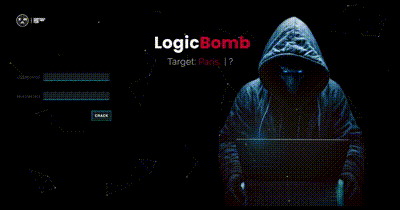

# 🧩 Logic Bomb - A Cryptographic Adventure

Welcome to **Logic Bomb**, a captivating landing page designed as part of a programming competition segment for Sunnydale Math X Tech club.



## 🚀 Project Overview

Logic Bomb serves as the central interface for an exhilarating cryptographic challenge. Participants assume the role of elite cryptologists, racing against the clock to prevent a catastrophic nuclear attack orchestrated by terrorists. The interface allows users to input their agent number and cracked password to save the world from impending doom.

## ✨ Features

- **Beautiful UI Design**: A visually appealing and intuitive interface that engages participants and enhances their experience.
- **Interactive Elements**: Smooth animations and transitions powered by GSAP to provide a dynamic and responsive user experience.
- **Input Fields**: Secure agent number and password input fields to validate participant entries.
- **Competition-Ready**: Designed specifically for a high-stakes programming competition, ensuring functionality and reliability.

## 🛠 Technologies Used

- **PHP**: Server-side scripting for processing input and managing data.
- **HTML**: Structure and content of the landing page.
- **CSS**: Styling for a polished and visually appealing design.
- **Bootstrap**: Responsive design framework for creating a mobile-friendly interface.
- **JavaScript**: Client-side scripting for interactive elements and form validation.
- **jQuery**: Simplified DOM manipulation and event handling.
- **GSAP (GreenSock Animation Platform)**: High-performance animations for a smooth and engaging user experience.
- **particles.js**: Library for creating animated particle backgrounds.


## 🎯 Segment Description

### Logic Bomb

> _Not a single breath of air do we have the luxury of wasting. This is code red! After relentless years of chaotic blurs of gunfire, we were able to finally recover one of the terrorists’ laptops containing all forthcoming plans of indiscriminate mass murder. However, there is a catch! This laptop’s data is blocked with multiple layers of security that takes only the greatest cryptologists to crack. With countless lives weighing on our fingertips, we can only rely on such masterminds to clear the safeguarding and access the laptop’s information._

> _This is your opportunity to showcase your divine wit skills on a polished pedestal. Decode clues and crypts to work out puzzle-based questions and expose the schemes behind the laptop screen. As the clock hustles, so must you!_

> _So tell me decipherer, do you have what it takes to withstand the threat made by these madmen? The fate of the entire world now rests on your hands!_


## 📥 Installation

* Install MAMP or XAMPP to run this project locally using an APACHE/ NGINX server.

To run this project locally:

1. Clone the repository:
    ```bash
    git clone https://github.com/yourusername/logic-bomb.git
    ```
2. **Move the project to the MAMP `htdocs` directory**:
    ```bash
    mv logic-bomb /Applications/MAMP/htdocs/
    ```
3. **Start MAMP**:
    - Open the MAMP application.
    - Click on "Start Servers".

4. **Configure MAMP**:
    - Go to `Preferences` > `Web Server`.
    - Set the `Document Root` to the `htdocs` folder where you moved the project: `/Applications/MAMP/htdocs/logic-bomb`.

5. **Access the project in your web browser**:
    - Open your web browser and go to:
    ```
    http://localhost:8888/logic-bomb
    ```

## 🎮 Usage

1. Enter your agent number and cracked password in the designated input fields.
2. Submit your entry to see if you have successfully defused the bomb threat.

## 🤝 Contributing

Contributions are welcome! If you have suggestions for improvements or new features, feel free to create a pull request or open an issue.

---

Join the mission and showcase your cryptographic skills. The world is counting on you!
